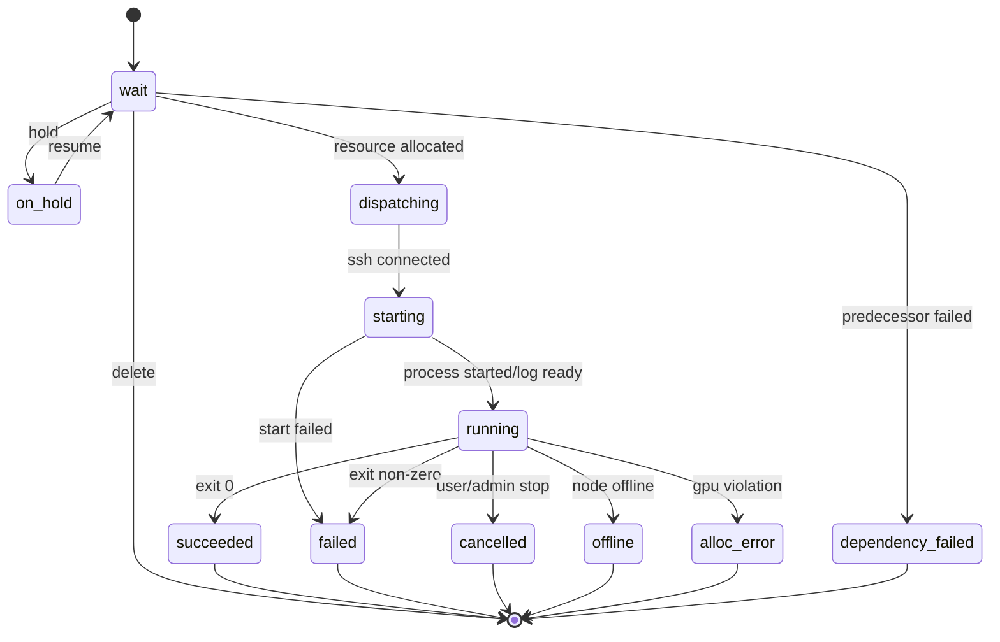

# NebulaGrid（天枢）3.0 需求规格说明书与开发蓝图

> 本文档为 GitHub/Codex 开发用 Markdown 版，由需求规格说明书 DOCX 转换整理而来。

分布式 GPU 任务调度、节点监控、环境与文件管理平台

需求分析 · 架构设计 · 数据模型 · API 草案 · 验收标准

版本：V1.0（开发准备稿）  
日期：2026-05-17  
系统名称：NebulaGrid（天枢）  
适用阶段：3.0 纯 B/S 重构开发准备阶段

本文档根据现有 DDLTM 3.0 需求草案、DDLTM 2.0 任务调度代码、过渡 Web 版开发文档与实验室实际使用场景整理。

# 文档控制

| **版本** | **日期**   | **说明**                                                                                                    | **状态**   |
|----------|------------|-------------------------------------------------------------------------------------------------------------|------------|
| V0.1     | 2026-05-17 | 根据原始 3.0 需求草案整理初始开发版结构。                                                                   | 草稿       |
| V0.9     | 2026-05-17 | 补充纯 B/S 架构、RBAC、数据模型、API、调度事务、异常恢复和验收标准。                                        | 开发准备稿 |
| V1.0     | 2026-05-17 | 补充环境离线包/源码包安装、指定节点/GPU 编译安装作业、运行中任务守护线程、GPU 越权检测与 alloc_error 状态。 | 开发准备稿 |

## 编写依据与继承关系

本稿将 3.0 定位为一次重构，而不是在 2.0 上继续叠加页面。2.0 的核心价值在于已经验证了任务队列、节点监控、SSH 远程执行、日志读取、文件管理和管理员操作等业务闭环；3.0 的核心目标是将这些能力沉淀为纯 B/S 架构下的可维护产品。

- 继承 2.0：任务生命周期、等待区/运行区/历史区概念、GPU 型号约束、GPU 复用、前驱任务、节点强制下线、日志追踪、文件与环境管理等核心业务。

- 重构 2.0：弃用 PyQt 客户端与 socket mode 协议作为主要入口，统一使用浏览器、REST API 和 WebSocket/SSE 推送。

- 修正 2.0：避免 Web 端直接读取 master 进程全局变量，改为数据库与调度服务共同维护单一事实来源；避免任务状态、页面状态和持久化文件彼此分裂。

- 扩展 3.0：增加角色权限矩阵、审计日志、登录设备追踪、历史任务分页、任务事件流、环境包上传与校验、文件路径安全和更明确的异常恢复语义。

# 静态目录

- 1. 当前草案评审与重构结论

- 2. 项目概述

- 3. 系统边界与总体架构

- 4. 角色、权限与数据可见性

- 5. 功能性需求

- 6. 核心业务流程

- 7. 数据模型与状态枚举

- 8. API 与前后端交互设计

- 9. 调度与执行设计

- 10. 文件、环境与日志子系统

- 11. 安全、审计与运维需求

- 12. 前端页面与交互要求

- 13. 迁移与开发实施计划

- 14. 测试方案与验收标准

- 15. 风险清单与后续路线图

- 附录 A. 配置样例

- 附录 B. Mermaid/PlantUML 草图

- 附录 C. 术语表

# 1. 当前草案评审与重构结论

## 1.1 草案已经明确的核心需求

原始需求草案已经覆盖系统最重要的业务对象，包括角色、用户字段、节点字段、监控字段、任务字段、任务生命周期、调度策略、执行线程、环境管理、文件管理、用户在线状态与日志管理。这些内容足以说明系统的业务方向，但还不能直接作为开发任务拆分和接口实现依据。

| **已覆盖内容** | **开发价值**                                            | **需进一步形式化的点**                                     |
|----------------|---------------------------------------------------------|------------------------------------------------------------|
| 角色体系       | 明确学生、导师、管理员、展示者四类入口。                | 需要权限矩阵、数据可见范围、操作边界、接口鉴权规则。       |
| 节点管理       | 明确公开节点、私人节点、所有人、开放使用和 GPU 可用性。 | 需要节点状态机、GPU 子表、维护模式、重连/强制下线语义。    |
| 任务管理       | 保留 2.0 中等待、运行、历史三个区域和核心调度策略。     | 需要事务化资源分配、任务事件表、失败原因、重试与恢复规则。 |
| 文件与环境     | 用户可管理项目文件和 conda 环境。                       | 需要路径解析、安全边界、上传限制、conda-pack 导入流程。    |
| 日志与在线状态 | 需要查看任务日志和用户登录记录。                        | 需要日志 tail/全量/下载接口、登录设备模型与审计日志。      |

## 1.2 主要缺口

- 缺少数据库设计。3.0 不应继续依赖 JSON 文件作为主要状态存储，否则无法稳定支持分页、筛选、审计、权限、多用户会话和任务事件追踪。

- 缺少接口设计。纯 B/S 架构必须明确前端调用哪些 API、每个 API 的权限、请求字段、返回字段和错误码。

- 缺少并发一致性设计。任务从 wait 到 dispatching 再到 running 的资源占用必须具备原子性，不能只依赖内存列表和线程锁。

- 缺少异常恢复设计。节点掉线、master 重启、SSH 中断、任务启动失败、日志文件丢失、GPU 被用户越权使用等场景需要明确处理。

- 缺少安全边界。文件管理、命令执行、环境激活和路径映射都涉及服务端权限，必须统一通过 resolver 和 RBAC 控制。

## 1.3 重构结论

```text
**结论：**NebulaGrid 3.0 建议定义为“纯 B/S 的分布式 GPU 任务调度与实验资源管理平台”。前端只通过 HTTP/WebSocket 与后端交互；后端由 API 服务、调度服务、节点监控服务、任务执行器、文件环境服务和持久化层组成。2.0 的 PyQt 客户端、socket mode 协议和 JSON 任务文件可作为迁移参考，不再作为 3.0 主路径。
```

“NebulaGrid（天枢）”这个名字可用。NebulaGrid 表示星云状分布式算力网格，“天枢”对应北斗定位与调度中枢，适合表达“统一管理、多节点协同、资源导航”的产品含义。正式软著或横向项目材料中建议使用中文全称“天枢 NebulaGrid 分布式 GPU 任务调度与资源管理平台”。

# 2. 项目概述

## 2.1 建设背景

随着实验室深度学习任务规模扩大，多台 GPU 工作站的使用状态、任务排队、环境配置、日志查看和结果文件管理逐渐成为影响科研效率的关键工程问题。传统做法依赖用户手动 SSH 到不同节点，通过 nvidia-smi 查看空闲 GPU，再自行启动训练脚本。这种模式在多人共享、硬件异构、节点分散、网络受限和任务长期运行的场景下容易出现资源冲突、日志分散、任务状态不可追踪和管理员维护困难等问题。

NebulaGrid 3.0 的目标是提供一个浏览器即可访问的统一入口，使学生、导师、管理员和展示者可以在不同权限范围内完成节点查看、任务提交、日志追踪、文件管理、环境管理、用户管理和系统维护。系统不替代深度学习框架本身，也不负责训练脚本内部的分布式通信；它解决的是实验室级别的任务排队、资源分配、状态可见和运维管理问题。

## 2.2 建设目标

| **目标** | **说明**                                                                    | **验收口径**                                             |
|----------|-----------------------------------------------------------------------------|----------------------------------------------------------|
| 统一入口 | 所有用户通过浏览器登录，不再依赖 PyQt 客户端；如确需 SSH，仅登录 master 上的个人子账户，不直接登录计算节点。 | 普通用户可在浏览器完成提交任务、看日志、管理文件和环境。 |
| 轻量调度 | 支持 GPU 数量、GPU 型号、指定节点、GPU 复用、前驱任务、紧急任务和挂起任务。 | 任务可自动匹配可用节点并正确占用/释放资源。              |
| 权限清晰 | 按学生、导师、管理员、展示者划分可见数据和操作权限。                        | 越权访问 API 返回 403，界面不显示无权按钮。              |
| 状态一致 | 数据库、调度服务、节点监控、前端页面和日志记录围绕同一事实来源。            | 刷新页面、重启后状态不出现明显分裂。                     |
| 便于维护 | 支持节点上线/下线/重连/维护，支持配置备份、审计日志、历史分页和故障追踪。   | 管理员可定位谁在何时执行了什么操作以及影响哪些任务。     |

## 2.3 功能边界

- 系统负责调度和启动用户命令，不负责保证用户代码本身正确。训练脚本报错、数据路径错误、CUDA 版本不匹配应记录为任务失败。

- 系统不是强隔离容器平台。若暂不使用 Docker/容器，用户任务仍运行在计算节点的统一主账户下，例如 `ddltm`；该主账户必须在 master 和所有计算节点保持用户名、密码、UID、GID 一致。平台用户子账户只在 master 创建，用于用户 SSH 到主节点和访问自己的 `/home/ddltm/data/user/<user_name>` home；`NEBULAGRID_MAIN_LINUX_USER` 对应的主账户受保护并复用，不由平台修改系统密码或删除。因此必须通过路径约束、GPU 绑定检测、审计和制度约束降低风险。

- 系统不是 Slurm/Kubernetes 的替代品。3.0 面向实验室多机多卡、轻量任务排队和 Web 管理场景，优先保证简单、可维护、可恢复。

- 系统不开放自助注册。账号由管理员或导师在权限范围内创建，初始管理员账号由初始化脚本生成。

# 3. 系统边界与总体架构

## 3.1 3.0 总体架构原则

3.0 必须彻底转向纯 B/S 架构。前端页面、移动浏览器和展示大屏都只是同一个 Web 应用的不同视图，不能再出现 PyQt 客户端与 Web 页面各自维护一套交互协议的情况。后端也不应把 Web 路由直接嵌入调度线程并读取全局列表，而应通过服务层封装业务动作，通过数据库与事件流维护状态。

| **层次**   | **建议组件**                                                                 | **主要职责**                                                             |
|------------|------------------------------------------------------------------------------|--------------------------------------------------------------------------|
| 前端层     | Vue/React + TypeScript + 路由 + 状态管理                                     | 登录、仪表盘、节点、任务、文件、环境、日志、用户、管理员后台和展示大屏。 |
| API 层     | FastAPI/Flask/Django 任一 Python Web 框架                                    | 统一鉴权、参数校验、REST API、WebSocket/SSE、错误码和审计入口。          |
| 业务服务层 | TaskService、NodeService、FileService、EnvService、UserService、AuditService | 封装权限判断、状态流转、资源分配、路径解析和系统操作。                   |
| 调度层     | Scheduler Service 单实例运行                                                 | 扫描等待任务，选择节点和 GPU，事务化占用资源，启动执行器。               |
| 节点层     | SSH Runner / Worker Agent                                                    | 采集节点状态、启动任务、回收任务、上传日志、响应下线和中止命令。         |
| 持久化层   | PostgreSQL/SQLite + InfluxDB + 文件系统 + 日志目录                           | PostgreSQL 保存用户、节点、GPU、任务、事件、环境、审计和配置；InfluxDB 保存节点/GPU 历史监控指标。 |

## 3.2 部署拓扑

最小可用部署仍然保持一个主控节点和若干计算节点。主控节点运行 Web 后端、调度器、节点监控器和数据库；主控节点与计算节点通过 NFS 协议共享 `/home/ddltm/data` 和 `/home/ddltm/envs`。`/home/ddltm/data/user/<user_name>` 是平台用户在 master 上的 home 目录，`/home/ddltm/data/logs` 存储任务日志和环境安装日志，`/home/ddltm/data/runtime` 存储运行时文件，`/home/ddltm/envs` 存储 miniconda、用户环境目录和节点监控/远端执行代码。计算节点只需要创建与 master 一致的主账户并允许主控节点通过该账户 SSH 访问，不创建平台用户子账户。若后续要提升可靠性，可以将数据库独立部署，并把调度器保持为单实例以避免重复派发任务。

```text
用户浏览器 / 展示大屏
        │ HTTPS
        ▼
[NebulaGrid Web/API 主控节点]
├── API Server：鉴权、接口、WebSocket/SSE
├── Scheduler：等待任务扫描与资源分配
├── Monitor：节点状态采集与看门狗
├── Executor：SSH 启动/停止任务
├── PostgreSQL：用户、节点、GPU、任务、事件、审计
├── InfluxDB：节点/GPU 历史监控指标
└── NFS Storage：/home/ddltm/data + /home/ddltm/envs（用户 home、日志、运行时、miniconda、环境、节点监控代码）
        │ SSH 控制命令 + NFS 共享文件
        ▼
[计算节点 A/B/C...]：运行用户训练命令，返回状态与日志
```

## 3.3 3.0 与 2.0 的核心差异

| **维度** | **2.0/过渡 Web 版**                                  | **3.0 目标形态**                                       |
|----------|------------------------------------------------------|--------------------------------------------------------|
| 入口     | PyQt 客户端为主，Web 页面作为嵌入式补充。            | 浏览器为唯一正式入口，展示大屏也是 Web 视图。          |
| 通信     | socket mode 协议 + Web 路由并存。                    | REST API + WebSocket/SSE，统一鉴权与错误码。           |
| 状态     | wait_task/exec_task/hist_task 内存列表 + JSON dump。 | 数据库任务表 + 任务事件表 + 调度缓存，必要时导出归档。 |
| 权限     | 早期以用户名或页面判断为主。                         | 基于角色和数据范围的 RBAC/ABAC。                       |
| 历史任务 | 历史列表随时间增长，页面可能变慢。                   | 数据库分页、筛选、归档、导出。                         |
| 节点异常 | 依赖 monitor 和强制下线函数处理。                    | 节点状态机、任务事件、资源释放事务、审计记录。         |
| 文件路径 | 以 root/visible_folders 约束为基础。                 | 统一 PathResolver，所有文件 API 禁止自行拼接绝对路径。 |

## 3.4 推荐代码结构

```text
nebulagrid/
├── backend/
│   ├── main.py                    # API 服务入口
│   ├── core/
│   │   ├── config.py              # 配置加载、密钥、路径
│   │   └── security.py            # 密码、会话、权限装饰器
│   ├── db/
│   │   ├── models.py              # ORM 模型
│   │   └── migrations/            # 数据库迁移
│   ├── services/
│   │   ├── task_service.py
│   │   ├── scheduler.py
│   │   ├── executor.py
│   │   ├── node_service.py
│   │   ├── monitor.py
│   │   ├── file_service.py
│   │   ├── env_service.py
│   │   ├── user_service.py
│   │   └── audit_service.py
│   ├── api/
│   │   ├── auth.py
│   │   ├── nodes.py
│   │   ├── tasks.py
│   │   ├── files.py
│   │   ├── envs.py
│   │   ├── users.py
│   │   ├── admin.py
│   │   └── dashboard.py
│   └── workers/
│       ├── ssh_runner.py
│       ├── gpu_guard.py
│       └── log_streamer.py
├── frontend/
│   ├── src/pages/
│   │   ├── dashboard/
│   │   ├── nodes/
│   │   ├── tasks/
│   │   ├── logs/
│   │   ├── files/
│   │   ├── envs/
│   │   ├── users/
│   │   ├── admin/
│   │   └── visual/
│   ├── src/api/client.ts
│   └── src/store/
├── scripts/
│   ├── init_admin.py
│   ├── migrate_2x_tasks.py
│   ├── health_check.py
│   └── backup_db.py
└── docs/
    ├── deployment.md
    ├── api.md
    ├── user_manual.md
    └── admin_manual.md
```


# 4. 角色、权限与数据可见性

## 4.1 角色定义

| **角色** | **英文值** | **定位**                                                   | **默认入口** |
|----------|------------|------------------------------------------------------------|--------------|
| 学生     | student    | 普通实验用户，管理自己的文件、环境和任务。                 | 个人工作台   |
| 导师     | supervisor | 具备学生能力，并可查看和管理自己学生的账号信息与实验资产。 | 导师工作台   |
| 管理员   | admin      | 系统维护者，可管理所有用户、节点、配置、任务和审计。       | 管理员后台   |
| 展示者   | visual     | 只读展示账号，只能查看节点状态、任务数量和总体运行情况。   | 展示大屏     |

角色不是页面皮肤，而是 API 权限的基础。所有后端接口必须在服务层进行权限判断，即使前端隐藏了按钮，后端也必须阻止越权调用。

## 4.2 权限矩阵

| **功能/操作**                     | **学生**             | **导师**                               | **管理员**                   | **展示者**           |
|-----------------------------------|----------------------|----------------------------------------|------------------------------|----------------------|
| 查看公共节点与自己可用的私人节点  | 允许                 | 允许                                   | 允许                         | 仅汇总/隐藏敏感字段  |
| 查看节点 IP、SSH 用户名、配置详情 | 禁止                 | 禁止或仅本人私有节点                   | 允许                         | 禁止                 |
| 提交任务                          | 启用状态允许         | 启用状态允许                           | 允许                         | 禁止                 |
| 停止任务                          | 仅自己的运行任务     | 默认禁止停止学生任务，可停止自己的任务 | 所有任务                     | 禁止                 |
| 删除等待/历史任务记录             | 仅自己的任务         | 自己的任务；学生任务只读或按配置       | 所有任务                     | 禁止                 |
| 查看日志                          | 仅自己的任务日志     | 自己与学生任务日志                     | 所有日志                     | 仅统计，不看日志内容 |
| 文件管理                          | 仅自己的工作目录     | 自己与学生目录，只读/读写按配置        | 所有用户目录                 | 禁止                 |
| 环境管理                          | 仅自己的环境         | 自己与学生环境，只读/读写按配置        | 所有环境                     | 禁止                 |
| 用户管理                          | 修改自己的资料和密码 | 添加/停用/编辑自己的学生               | 所有用户                     | 禁止                 |
| 节点管理                          | 禁止                 | 可申请或管理本人私有节点（可选）       | 新增、编辑、下线、重连、删除 | 禁止                 |
| 配置管理                          | 禁止                 | 禁止                                   | 允许                         | 禁止                 |
| 审计日志                          | 查看自己的登录记录   | 查看自己与学生登录记录                 | 查看所有审计                 | 禁止                 |

## 4.3 用户字段规范

| **字段**              | **类型**       | **必填**      | **说明/约束**                                                                             |
|-----------------------|----------------|---------------|-------------------------------------------------------------------------------------------|
| id                    | integer        | 必填          | 平台统一识别码；创建时可由管理员指定，未指定时由数据库递增生成。                          |
| username/name         | string         | 必填          | 登录名。建议使用姓名首字母缩写或统一命名；系统内部推荐统一称 username。                   |
| real_name             | string         | 学生/导师必填 | 真实姓名，用于导师关系、审计和展示。                                                      |
| role                  | enum           | 必填          | student / mentor / admin / viewer；早期 supervisor / visual 命名分别对应 mentor / viewer。 |
| supervisor_ids        | array/relation | 学生可填      | 一个学生可关联 1 到 2 位导师，使用 user_supervisors 关系表保存，不在 users 主表固定 supervisor1/2 字段。 |
| password_hash         | string         | 必填          | 不可保存明文密码。使用安全哈希和随机盐。                                                  |
| home_path/root        | string         | 必填          | 用户工作根目录，固定映射为 `/home/ddltm/data/user/<user_name>`。仅管理员可见绝对路径，普通用户只看到虚拟路径。 |
| linux_account_name    | string         | 必填          | master 上对应的 Linux 子账户名，用于用户 SSH 到主节点；该账户不在计算节点创建。            |
| linux_uid/linux_gid   | int            | 可选          | master 子账户 UID/GID，用于审计和排障；计算节点只保证主账户 UID/GID 与 master 一致。       |
| state                 | enum           | 必填          | enabled / disabled。disabled 账号不可登录，已登录会话在鉴权时会被拒绝。                    |
| created_at            | datetime       | 必填          | 记录账号创建时间。                                                                        |

文件打包和解压任务应持久化到 `file_jobs` 表，字段包括 `user_id`、`action`、`source_path`、`target_path`、`state`、`progress`、`current_file`、`message`、`created_at`、`updated_at` 和 `finished_at`。系统需要限制同一用户只能同时运行一个打包/解压任务，并设置全局并发上限，避免共享盘 IO 被大量压缩任务打满。API 启动时应把上次进程遗留的 `pending/running` 文件任务标记为失败，避免重启后长期占用并发名额。

## 4.4 登录与设备状态

系统应记录用户登录 IP、设备指纹、登录时间、退出时间、当前在线会话数量和当前在线 IP/设备。该信息主要用于用户自查是否被盗号，同时也是管理员追踪异常操作的重要依据。

| **字段**                | **说明**                                                                    |
|-------------------------|-----------------------------------------------------------------------------|
| token_hash              | 登录令牌摘要，禁止保存原始 token。                                          |
| login_ip                | 历史登录 IP，数据库字段为 `ip`，可按时间排序展示。                           |
| user_agent              | 原始浏览器 User-Agent，用于审计和设备识别。                                 |
| login_device            | 历史登录设备，使用 User-Agent 与可选设备指纹生成。                          |
| device_id               | 前端持久化设备指纹，用于区分同一 NAT/IP 下的多台设备。                       |
| login_time/logout_time  | 每次登录与退出时间；数据库中登录时间复用 `created_at`，退出时间为 `logout_at`。 |
| last_seen_at            | 最近活跃时间，用于推断在线状态。                                            |
| revoked_at              | 用户或管理员手动下线时间。                                                  |
| current_client          | 当前有效会话数量。                                                          |
| online_ip/online_device | 当前在线会话对应的 IP 与设备。                                              |
| session_state           | 登录会话专用状态，取值为 online/offline，由有效会话和心跳推断；API 不再返回通用 `state` 字段，避免与用户、节点和任务状态混用。 |
| status_label/status_category | 登录会话专用展示字段，前端直接用于登录设备状态标签；`offline` 在这里表示“已下线”，不是“节点掉线”。 |

# 5. 功能性需求

## 5.1 仪表盘与展示大屏

- 显示当前在线节点数、离线节点数、可用 GPU 数、运行中任务数、等待任务数、今日完成任务数和最近错误任务数。

- 显示节点卡片：节点名称、归属、状态、CPU 使用率、内存、网络速率、GPU 使用率、显存占用、GPU 任务数。

- 展示者账号只能看到汇总与公开字段，不显示 IP、登录用户名、用户文件路径、任务命令全文等敏感信息。

- 展示大屏应支持自动刷新和全屏模式，适合在实验室展板中长期打开。

## 5.2 节点管理

节点是调度资源的基本单位。3.0 中建议统一使用 worker/node 命名，不再在新代码中使用 slaver/slave 作为概念名；旧数据迁移时可将 slaver 映射为 node。

| **需求编号** | **需求描述**                                                                               | **优先级** |
|--------------|--------------------------------------------------------------------------------------------|------------|
| NODE-001     | 管理员可新增、编辑、删除计算节点。删除节点前必须确认其无运行任务，或先强制下线并处理任务。 | P0         |
| NODE-002     | 节点字段包括名称、IP、主账户 SSH 用户名、主账户 UID/GID、归属类型、所有人、是否开放、连接速度、备注、状态。 | P0         |
| NODE-003     | GPU 字段应从节点中拆分为 GPU 子表，记录 index、型号、显存总量、是否可调度、备注。          | P0         |
| NODE-004     | 支持节点上线、手动下线、维护模式、重新连接、强制下线并停止任务。                           | P0         |
| NODE-005     | 节点监控每隔固定时间采集 CPU、内存、网络、GPU 利用率、显存和运行进程摘要。                 | P0         |
| NODE-006     | watchdog 超时后节点自动置为 offline，并触发该节点运行任务的异常处理流程。                  | P0         |
| NODE-007     | 普通用户只能看到自己可使用节点，管理员可查看 IP、SSH 用户和完整配置。                      | P0         |

## 5.3 任务管理

| **需求编号** | **需求描述**                                                                                                           | **优先级** |
|--------------|------------------------------------------------------------------------------------------------------------------------|------------|
| TASK-001     | 用户可提交任务，填写任务描述、环境、项目路径、执行命令、GPU 数量、GPU 型号、指定节点、前驱任务、紧急/挂起/GPU 复用等。 | P0         |
| TASK-002     | 任务提交后系统生成 task_id，记录提交人、提交时间、原始参数和初始状态 wait/on_hold。                                    | P0         |
| TASK-003     | 用户可查看自己的等待、运行、历史任务；导师可查看学生任务；管理员可查看所有任务。                                       | P0         |
| TASK-004     | 学生可管理自己的任务；导师可查看并管理自己和名下学生任务；管理员可查看并管理所有任务。                                 | P0         |
| TASK-005     | 等待任务可编辑、挂起、恢复、删除；运行任务不可编辑核心资源字段。                                                       | P0         |
| TASK-006     | 历史任务支持分页、筛选、按用户/节点/状态/日期/关键字检索和重新提交。                                                   | P0         |
| TASK-007     | 任务状态变化必须写入 task_events，便于追踪从等待到运行再到结束的完整过程。                                             | P0         |
| TASK-008     | 任务可设置前驱任务，当前驱任务成功完成后才允许进入调度；若前驱失败，可按策略阻塞或标记依赖失败。                       | P1         |
| TASK-009     | 支持批量任务提交；批量命令一行一个，系统忽略空行、注释行和 `#` 后的注释内容。参数网格生成可作为后续增强。              | P1         |

当前前端任务管理页面采用“顶部动作按钮 + 左侧等待区/执行区/历史区 + 列表”的结构。等待区提供“挂起/取消挂起选中任务”切换操作，并支持点击列表行任意位置选中任务。等待区禁用中止、重新提交、查看所有历史任务和查看日志；执行区禁用修改、挂起/取消挂起、删除、重新提交和查看所有历史任务；历史区禁用挂起/取消挂起和中止。历史区默认加载最近 100 条可见任务，用户显式点击“查看所有历史任务”后才加载全部可见历史任务。任务区切换只刷新当前任务列表，不重复拉取环境和节点；后端提供当前用户可见任务变化 SSE 流，任务新增、状态流转、删除等变化发生后，前端自动轻量刷新当前界面。

## 5.4 环境管理

3.0 的环境管理应同时支持“已有 conda 环境登记”和“用户上传 conda-pack 环境包”。考虑到主节点不联网，推荐流程是：用户在个人电脑或 WSL/Linux 环境中维护 conda 环境，使用 conda-pack 打包后上传到系统，由系统在 NFS 共享的 `/home/ddltm/envs/miniconda3/envs/<env_name>` 下解包并执行校验。环境必须直接位于 miniconda 的 `envs` 一级目录下，不能再按用户创建二级目录，否则 miniconda 无法识别。用户也可以 SSH 到 master 的个人子账户整理自己的 `/home/ddltm/data/user/<user_name>` 文件，但不直接登录计算节点。

除完整环境导入外，3.0 还应支持“环境内包安装”能力。用户可在环境详情页上传 .whl 文件或压缩的 Python 包（.zip/.tar/.tar.gz/.tgz），选择目标环境后由系统自动安装或导入。该功能用于解决主控节点不联网、用户无法直接 SSH 维护环境时的增量更新问题。

环境包安装规则如下：若选择 conda `.tar.bz2` 包，则系统在目标环境中执行 `conda install --offline`；若选择 `.whl`，则执行 `pip install --no-index <wheel_path>`；若选择批量 whl，则执行 `pip install --no-index --find-links=<folder> -r requirements.txt`；若选择源码目录，则进入目录后执行 `pip install .` 或 `python setup.py install`。系统不自动解析或下载依赖，用户需自行准备依赖包。安装期间前端显示“安装中”并提示不要关闭页面。

对于需要本地编译或 CUDA 编译的包，用户可选择“编译安装”模式，并指定编译节点及可见 GPU。编译安装属于环境维护作业，不进入普通任务等待队列，不由任务调度器分配资源，也不计入任务资源占用；但系统必须记录编译作业、执行节点、可见 GPU、远端 PID、日志和审计事件，管理员可查看或中止。

为避免环境污染，每次包安装应写入 env_install_jobs 与 env_package_manifests：记录上传包、目标环境、安装命令、安装前后 pip freeze 差异、导入文件清单、返回码和日志路径。安装失败时不得把环境标记为 available，前端应显示失败原因并允许用户下载日志。

| **需求编号** | **需求描述**                                                                                                                        | **优先级** |
|--------------|-------------------------------------------------------------------------------------------------------------------------------------|------------|
| ENV-001      | 用户可查看自己的环境列表，包括环境名、描述、创建时间、大小、Python 版本、框架检测结果。                                             | P0         |
| ENV-002      | 用户可上传 .tar.gz/.zip 环境包，系统解包到用户环境目录，并校验是否来自 Linux/WSL。                                                  | P0         |
| ENV-003      | 系统提供环境测试：python --version、pip/conda 包列表、PyTorch CUDA、TensorFlow CUDA、nvidia-smi 可见性。                            | P0         |
| ENV-004      | 任务提交时必须选择一个有效环境，环境删除前应检查是否有等待或运行任务引用。                                                          | P0         |
| ENV-005      | 管理员可查看和删除所有环境；导师可查看学生环境，是否可删除由配置决定。                                                              | P1         |
| ENV-006      | 支持环境包版本记录，避免同名环境被覆盖后历史任务无法复现。                                                                          | P1         |
| ENV-007      | 用户可在环境详情页上传 .whl、.zip、.tar、.tar.gz、.tgz 等 Python 包文件，并选择安装到指定环境。                                     | P0         |
| ENV-008      | 系统支持 conda `.tar.bz2` 离线安装、pip whl 单包安装、requirements 批量安装和源码目录安装；不再提供直接复制到 site-packages 的安装方式。 | P0         |
| ENV-009      | 支持环境包编译安装作业：用户可指定节点和可见 GPU，作业不进入任务调度队列、不占用任务调度资源，但必须记录日志、PID、返回码和审计。   | P1         |
| ENV-010      | 环境包安装完成后应执行 python -c import 校验、pip freeze 差异记录和可选 CUDA 可见性测试。                                           | P1         |
| ENV-011      | 环境包安装必须防止路径穿越、软链接逃逸、覆盖系统文件和跨用户环境写入；压缩包中的危险路径应直接拒绝。                                | P0         |

## 5.5 文件管理

| **需求编号** | **需求描述**                                                                      | **优先级** |
|--------------|-----------------------------------------------------------------------------------|------------|
| FILE-001     | 文件管理必须基于虚拟路径，不向普通用户暴露服务器绝对路径。                        | P0         |
| FILE-002     | 支持上传、下载、删除、重命名、新建文件夹、压缩文件夹、解压 zip/tar/tar.gz/tgz/tar.bz2/tbz2/tar.xz/txz。       | P0         |
| FILE-003     | 支持文本文件预览和在线编辑；图片、音频、视频按格式预览；不支持格式提示下载。      | P0         |
| FILE-004     | 所有路径必须通过 PathResolver 验证，禁止 ..、软链接逃逸、绝对路径绕过和越权访问。 | P0         |
| FILE-005     | 大文件上传应支持大小限制、进度显示和失败重试；管理员可配置 max_upload_size。      | P1         |
| FILE-006     | 危险操作删除/覆盖/解压需二次确认，并写入审计日志。                                | P0         |

## 5.6 日志管理

- 任务日志路径默认为 `/home/ddltm/data/logs/task_logs/<task_id>.log`，由 master 与计算节点通过 NFS 共享，可由配置修改。

- 等待任务显示“任务尚未运行，暂无日志”；dispatching/starting 显示“环境启动中，暂无日志”；运行任务支持 tail 刷新；历史任务支持全量查看和下载。

- 日志刷新应使用 WebSocket/SSE 或轮询。运行任务刷新频率由管理员配置，任务结束后前端自动停止刷新。

- 日志接口必须检查任务归属权限。普通用户不能通过 task_id 猜测读取他人日志。

- 对于超大日志，默认只返回最后 N KB，并提供“下载完整日志”。

## 5.7 用户与管理员后台

| **模块**       | **功能要求**                                                                          |
|----------------|---------------------------------------------------------------------------------------|
| 用户资料       | 修改密码、修改头像、查看登录记录、查看当前设备、退出其他会话。                        |
| 导师管理       | 导师可添加学生、编辑学生资料、停用/启用学生账号、查看学生任务/文件/环境。             |
| 管理员用户管理 | 添加/删除/停用用户、重置密码、修改角色、绑定导师、设置用户根目录。                    |
| 管理员节点管理 | 节点增删改查、GPU 可用性、所有人多选、使用权/共享范围、维护模式、重连、强制下线、节点备注。 |
| 管理员系统配置 | 日志刷新间隔、上传大小、GPU 复用阈值、最大复用数、watchdog 超时、可见目录、系统公告。 |
| 审计日志       | 查看用户登录、任务操作、文件操作、节点操作、配置修改等记录。                          |

# 6. 核心业务流程

## 6.1 任务提交流程

1. 用户进入“提交任务”页面，系统读取该用户可见环境、可见项目目录、可用节点和 GPU 型号。

2. 用户填写任务参数并提交。前端进行基础校验，后端进行权限、路径、环境和资源字段校验。

3. 后端创建 tasks 记录，状态为 wait 或 on_hold，并写入 task_events：created。

4. 调度器周期性扫描等待任务。若用户已停用、前驱未完成、节点不可用或资源不足，则保持等待并记录最近阻塞原因。

5. 资源满足时，调度器在事务中创建 task_allocations，更新状态为 dispatching/starting，并启动执行器。

6. 执行器通过 SSH 激活环境、设置 CUDA_VISIBLE_DEVICES、进入项目目录、运行命令，并将 stdout/stderr 写入日志。

7. 首条日志或进程启动成功后状态变为 running。任务退出后根据返回码和停止原因变为 succeeded/failed/cancelled/offline。

8. 资源释放，任务进入历史视图，但仍保留任务表记录和事件流。

## 6.2 节点异常流程

1. 监控器无法获取节点状态或 watchdog 超过阈值，将节点置为 offline。

2. 系统查询该节点上处于 dispatching/starting/running 的任务。

3. 对已启动任务写入 node_offline 事件，并按策略标记 offline 或 lost；对未真正启动的任务可释放资源并重新进入 wait。

4. 释放该节点 GPU/CPU 资源占用，避免页面显示资源仍被占用。

5. 管理员可选择“重新连接”或“保持下线”。重新连接成功后节点变为 online，但不会自动恢复已标记失败的任务，除非用户或管理员手动重新提交。

## 6.3 强制下线流程

强制下线是危险操作，应区别于“临时禁用调度”和“重新连接”。强制下线表示管理员主动要求节点退出调度，并停止或标记该节点上的任务。该操作必须弹出确认框，列出受影响任务，并写入审计日志。

| **操作** | **对节点状态影响**            | **对任务影响**                         | **适用场景**             |
|----------|-------------------------------|----------------------------------------|--------------------------|
| 禁用调度 | node.scheduling_enabled=false | 不影响已运行任务，只是不再分配新任务。 | 临时保留给已有任务跑完。 |
| 维护模式 | state=maintenance             | 可配置是否允许现有任务继续。           | 硬件维护前准备。         |
| 重新连接 | 尝试重启监控连接              | 不应修改任务状态。                     | 节点在线但监控无数据。   |
| 强制下线 | state=offline/manual_offline  | 停止或标记该节点任务，并释放资源。     | 断电、拔卡、紧急维护。   |
| 删除节点 | 从配置和数据库标记删除        | 必须无运行任务或先强制下线。           | 节点退役。               |

# 7. 数据模型与状态枚举

## 7.1 推荐持久化模型

PostgreSQL 负责业务状态和调度一致性；InfluxDB 负责持续写入的节点/GPU 监控时序数据。`node_metrics` 和 `gpu_metrics` 是 InfluxDB measurement，不再作为 PostgreSQL 表创建。

| **对象**              | **核心字段**                                                                                                                                      | **说明**                                                        |
|-----------------------|---------------------------------------------------------------------------------------------------------------------------------------------------|-----------------------------------------------------------------|
| users                 | id, username, real_name, role, password_hash, state, home_path, linux_account_name, linux_uid, linux_gid, created_at                              | 用户基础信息与 master 子账户映射。                              |
| user_supervisors      | student_id, supervisor_id                                                                                                                         | 学生与导师多对多关系，限制每名学生 1-2 位导师。                 |
| login_sessions        | user_id, token_hash, ip, user_agent, login_device, device_id, last_seen_at, logout_at, expires_at, revoked_at, created_at                        | 登录设备与在线状态；只保存 token 摘要，不保存原始令牌。         |
| nodes                 | id, name, ip, ssh_user, owner_type, owner_user_id, owner_user_ids, access_scope, sharing_scope, is_public, max_speed_mbps, state, scheduling_enabled | 计算节点；`owner_user_ids` 保存多个所有人，`access_scope` 控制公开/私有使用权，`sharing_scope` 控制普通用户总览中可用 GPU 的可见范围。 |
| gpus                  | id, node_id, gpu_index, model, total_vram_mb, schedulable, remark                                                                                 | 节点 GPU 子资源。                                               |
| node_metrics          | InfluxDB measurement：node_id, cpu_usage, avail_ram_mb, upload_mbps, download_mbps, collected_at                                                   | 节点监控快照和历史曲线，不再保存为 PostgreSQL 表。              |
| gpu_metrics           | InfluxDB measurement：gpu_id, gpu_usage, free_vram_mb, process_count, called, collected_at                                                         | GPU 监控快照和历史曲线，不再保存为 PostgreSQL 表。              |
| envs                  | id, owner_user_id, name, path, description, source_type, state, python_version, size_bytes, created_at                                            | 用户环境。                                                      |
| tasks                 | id, task_id, user_id, description, env_id, workdir, command, state, priority, on_hold, created_at, started_at, finished_at                        | 任务主表。                                                      |
| task_requirements     | task_id, need_gpus, gpu_types, node_id, allow_gpu_reuse, max_reuse_count                                                                          | 任务资源需求。                                                  |
| task_dependencies     | task_id, prev_task_id, policy                                                                                                                     | 前驱任务关系。                                                  |
| task_allocations      | task_id, node_id, gpu_ids, cpu_allocated, allocation_mode, allocated_at, released_at                                                              | 资源占用记录。                                                  |
| task_events           | task_id, event_type, message, actor_user_id, created_at, detail_json                                                                              | 任务事件流。                                                    |
| audit_logs            | actor_user_id, action, target_type, target_id, ip, result, created_at, detail_json                                                                | 审计日志；管理员后台按系统、用户、压缩文件、文件、任务、环境、节点和其他分类查询。 |
| settings              | key, value, updated_by, updated_at                                                                                                                | 系统配置。                                                      |
| env_packages          | id, env_id, owner_user_id, filename, package_type, file_path, size_bytes, sha256, status, created_at                                              | 用户上传的 wheel 或压缩 Python 包元数据。                       |
| env_install_jobs      | id, package_id, env_id, mode, target_node_id, visible_gpu_indices, status, remote_pid, log_path, return_code, created_by, started_at, finished_at | 环境包安装/编译作业。该表独立于 tasks，不进入普通调度队列。     |
| env_package_manifests | id, job_id, env_id, path, action, file_hash, created_at                                                                                           | 记录安装作业产生的文件清单，便于审计和可选卸载。 |
| env_operation_logs    | id, env_id, env_name, action, message, actor_user_id, status, command, return_code, stdout, stderr, detail_json, log_path, created_at             | 记录环境导入、复制、修复、检测、包安装、包删除和环境删除等结构化操作日志。 |
| task_runtime_guards   | id, task_id, node_id, root_pid, process_group_id, allocated_gpu_ids, observed_gpu_uuids, violation_count, last_check_at, state                    | 运行中任务守护检测记录，用于 PID/GPU 使用一致性校验。           |

## 7.2 任务状态枚举

| **状态**          | **中文名** | **进入条件**                                                                 | **可执行操作**                               |
|-------------------|------------|------------------------------------------------------------------------------|----------------------------------------------|
| wait              | 等待中     | 任务提交且未挂起，等待调度。                                                 | 编辑、删除、挂起、提优先级。                 |
| on_hold           | 挂起       | 用户或管理员主动挂起。                                                       | 恢复、编辑、删除。                           |
| dispatching       | 派发中     | 调度器已选中资源，正在创建执行线程/SSH 会话。                                | 管理员可强制取消。                           |
| starting          | 启动中     | SSH 已连接，正在激活环境和进入目录。                                         | 中止。                                       |
| running           | 运行中     | 任务进程已启动并产生日志或确认运行。                                         | 中止、查看日志。                             |
| succeeded         | 完成       | 进程返回码为 0。                                                             | 查看日志、下载、重新提交、删除记录。         |
| failed            | 错误       | 返回码非 0 或启动失败。                                                      | 查看错误、重新提交、删除记录。               |
| cancelled         | 中止       | 用户/管理员主动停止。                                                        | 查看日志、重新提交、删除记录。               |
| offline           | 节点掉线   | 运行期间节点离线或 SSH 中断。                                                | 查看事件、重新提交。                         |
| dependency_failed | 依赖失败   | 前驱任务失败且策略为失败阻断。                                               | 修改依赖、重新提交。                         |
| alloc_error       | 调度错误   | 守护线程检测到任务进程树实际使用了未分配 GPU，或 CPU-only 任务违规占用 GPU。 | 查看日志、重新提交；管理员查看守护检测记录。 |

补充约定：alloc_error 是一种独立的任务终态，前端中文显示为“调度错误”，后端错误码建议为 TASK_ALLOC_ERROR 或 GPU_ALLOCATION_VIOLATION。该状态不应与用户代码返回非 0 的 failed/error 混用。

## 7.3 节点状态枚举

| **状态**       | **含义**                   | **是否可调度**         |
|----------------|----------------------------|------------------------|
| online         | 监控正常且允许调度。       | 是                     |
| offline        | 监控断开或 watchdog 超时。 | 否                     |
| maintenance    | 管理员维护模式。           | 否，除非管理员手动允许 |
| disabled       | 节点被管理员禁用。         | 否                     |
| reconnecting   | 正在重新连接监控。         | 否                     |
| manual_offline | 管理员手动下线。           | 否                     |

# 8. API 与前后端交互设计

## 8.1 通用返回格式

```json
{
  "ok": true,
  "code": "OK",
  "message": "success",
  "data": {},
  "request_id": "20260517-xxxx"
}

{
  "ok": false,
  "code": "FORBIDDEN",
  "message": "无权访问该资源",
  "data": null,
  "request_id": "20260517-xxxx"
}
```

| **错误码**           | **HTTP 状态** | **说明**                         |
|----------------------|---------------|----------------------------------|
| UNAUTHORIZED         | 401           | 未登录或会话失效。               |
| FORBIDDEN            | 403           | 已登录但无权限访问。             |
| NOT_FOUND            | 404           | 资源不存在或对当前用户不可见。   |
| VALIDATION_ERROR     | 422           | 参数格式错误或业务校验失败。     |
| CONFLICT             | 409           | 状态冲突，例如删除正在运行任务。 |
| RESOURCE_UNAVAILABLE | 409/503       | 资源不足、节点不可调度。         |
| INTERNAL_ERROR       | 500           | 系统内部异常。                   |

## 8.2 API 草案

| **模块**  | **方法与路径**                                        | **说明**                                                                  | **权限**                         |
|-----------|-------------------------------------------------------|---------------------------------------------------------------------------|----------------------------------|
| Auth      | POST /api/auth/login                                  | 登录，支持 username/id/real_name + password。                             | 匿名                             |
| Auth      | POST /api/auth/logout                                 | 退出当前会话。                                                            | 登录用户                         |
| Auth      | GET /api/auth/me                                      | 获取当前用户资料、角色和权限。                                            | 登录用户                         |
| Auth      | POST /api/auth/sessions/list                          | 获取当前用户登录设备列表；会话状态使用 `session_state/status_label/status_category`，不使用通用 `state`。 | 登录用户                         |
| Auth      | POST /api/auth/sessions/offline                       | 手动下线当前用户指定登录设备。                                            | 登录用户                         |
| Admin     | POST /api/admin/login-management/online-users          | 获取当前在线用户摘要；用户启停状态仍使用用户对象的 `state`。                | 管理员                           |
| Admin     | POST /api/admin/login-management/user-sessions         | 查询指定用户登录设备；会话状态使用 `session_state/status_label/status_category`。 | 管理员                           |
| Admin     | POST /api/admin/login-management/offline-session       | 管理员下线任意用户指定登录设备。                                          | 管理员                           |
| Dashboard | GET /api/dashboard/summary                            | 获取节点、GPU、任务统计。                                                 | 所有角色，展示者脱敏             |
| Nodes     | GET /api/nodes                                        | 节点列表，按角色过滤字段。                                                | 登录用户                         |
| Nodes     | POST /api/admin/nodes                                 | 新增节点。                                                                | 管理员                           |
| Nodes     | PUT /api/admin/nodes/{id}                             | 修改节点基础信息、所有人、共享策略和 GPU 顺序清单。                        | 管理员                           |
| Nodes     | DELETE /api/admin/nodes/{id}                          | 删除退役节点，并清理调度直接引用。                                         | 管理员                           |
| Nodes     | POST /api/admin/nodes/{id}/reconnect                  | 重新连接节点。                                                            | 管理员                           |
| Nodes     | POST /api/admin/nodes/{id}/force-offline              | 强制下线并处理任务。                                                      | 管理员                           |
| Tasks     | GET /api/tasks                                        | 任务分页列表，支持 state/user/node/date/search。                          | 按角色过滤                       |
| Tasks     | POST /api/tasks                                       | 提交任务。                                                                | 学生/导师/管理员且账号启用       |
| Tasks     | GET /api/tasks/{task_id}                              | 任务详情。                                                                | 任务可见者                       |
| Tasks     | PATCH /api/tasks/{task_id}                            | 编辑等待/挂起任务。                                                       | 任务拥有者/管理员                |
| Tasks     | POST /api/tasks/{task_id}/cancel                      | 停止任务。                                                                | 拥有者/管理员                    |
| Tasks     | POST /api/tasks/{task_id}/resubmit                    | 重新提交。                                                                | 拥有者/管理员                    |
| Logs      | GET /api/tasks/{task_id}/log?tail=200KB               | 读取任务日志尾部。                                                        | 任务可见者                       |
| Logs      | GET /api/tasks/{task_id}/log/download                 | 下载完整日志。                                                            | 任务可见者                       |
| Files     | GET /api/files/list?path=/                            | 列当前用户文件根目录。                                                    | 路径可见者                       |
| Files     | POST /api/files/upload                                | 上传文件。                                                                | 路径可写者                       |
| Files     | GET /api/files/preview                                | 预览文本/图片/音视频。                                                    | 路径可见者                       |
| Files     | POST /api/files/archive                               | 压缩文件或目录。                                                          | 路径可写者                       |
| Files     | POST /api/files/extract                               | 解压 zip/tar/tar.gz/tgz/tar.bz2/tbz2/tar.xz/txz。                         | 路径可写者                       |
| Envs      | GET /api/envs                                         | 环境列表。                                                                | 按角色过滤                       |
| Envs      | POST /api/envs/upload-pack                            | 上传并导入 conda-pack 环境。                                              | 用户本人/管理员                  |
| Envs      | POST /api/envs/{id}/test                              | 测试环境。                                                                | 环境可见者                       |
| Users     | GET /api/users                                        | 用户列表。                                                                | 导师/管理员，按范围过滤          |
| Users     | POST /api/users                                       | 创建用户。                                                                | 导师创建学生；管理员创建任意角色 |
| Admin     | GET /api/admin/audit-logs?page=&page_size=&category=  | 审计日志分页查询；category 支持 all/system/user/archive/file/task/env/node/other。 | 管理员                           |
| Admin     | GET/PATCH /api/admin/settings                         | 系统设置读取和修改。                                                      | 管理员                           |
| Envs      | POST /api/envs/{env_id}/packages/upload               | 上传 whl 或压缩 Python 包，生成 env_package 记录。                        | 环境所有者/管理员                |
| Envs      | POST /api/envs/{env_id}/packages/{package_id}/install | 安装上传包；可选择 normal 或 compile 模式，compile 模式可指定节点和 GPU。 | 环境所有者/管理员                |
| Envs      | GET /api/env-install-jobs/{job_id}                    | 查询环境包安装/编译作业状态、返回码、节点和审计摘要。                     | 环境可见者                       |
| Envs      | GET /api/env-install-jobs/{job_id}/log                | 查看环境包安装/编译日志。                                                 | 环境可见者                       |
| Envs      | POST /api/env-install-jobs/{job_id}/cancel            | 中止正在执行的环境包安装/编译作业。                                       | 作业创建者/管理员                |
| Tasks     | GET /api/tasks/{task_id}/guard                        | 查看运行时守护线程检测摘要，包括 PID、进程组、分配 GPU 和最近观测 GPU。   | 任务可见者；普通用户脱敏         |

## 8.3 管理员节点保存字段

管理员后台“节点管理”页面应把节点列表和节点表单分开展示。节点列表展示所有计算节点，并在操作列提供“修改”“强制下线”“重连”“删除”按钮；新增节点使用独立卡片。点击某个节点的“修改”后，复用新增节点卡片完成编辑，但卡片标题应临时变为“修改节点”，提交成功后恢复为“新增节点”。

新增或修改节点时，前端应提交以下字段：

| 字段 | 类型 | 说明 |
|---|---|---|
| name | string | 节点名称，管理员可读的唯一名称。 |
| ip | string | 节点 IP 地址或 hostname。 |
| ssh_user | string | master 登录该节点使用的主账户，实验室默认 `ddltm`。 |
| max_speed_mbps | int nullable | 与主节点最大连接带宽，单位 Mbps。 |
| gpu_count | int | 节点实际 NVIDIA GPU 数量，包括亮机卡。 |
| gpu_models | string[] | GPU 型号列表，必须严格按 `nvidia-smi` 显示顺序保存；只填写型号后半部分，如 `RTX 2080 Ti`、`RTX 4090`、`Tesla V100`、`NVIDIA A100`。 |
| owner_user_ids | int[] | 节点所有人 ID 列表，可多选；前端应提供带搜索按钮的复选下拉框，也允许管理员直接输入 ID 兜底。 |
| access_scope | enum | `public` 表示公开使用，`private` 表示私有使用。 |
| sharing_scope | enum | `none` 不共享，`group` 组内共享，`public` 公开共享。 |

后端必须校验 `gpu_count` 与 `gpu_models` 条数一致，避免调度器按 GPU index 分配时出现错位。校验失败时应返回 `VALIDATION_ERROR`，HTTP 状态建议为 422，前端提示“GPU 数量必须与 GPU 型号列表条数一致”。

共享范围只影响普通用户在总览页“可用 GPU”和节点卡片中的可见资源，不应影响系统总览中的节点总数、在线节点、GPU 总数、运行任务等全局统计。具体规则如下：

| sharing_scope | 可见/可用范围 |
|---|---|
| none | 仅节点所有人和管理员可查看与使用。 |
| group | 若所有人为学生，则该学生导师名下学生可查看与使用；若所有人为导师，则该导师名下学生可查看与使用。 |
| public | 所有登录用户可查看与使用。 |

## 8.4 实时推送

- 节点状态：/ws/nodes 或 /sse/nodes，推送节点和 GPU 指标变化。

- 任务状态：/ws/tasks，推送任务新增、状态变化和统计变化。

- 任务日志：/ws/tasks/{task_id}/log，只允许任务可见者订阅，任务结束后服务端发送 ended 事件。

- 若部署环境不便使用 WebSocket，可先使用 2-5 秒轮询作为 MVP。

# 9. 调度与执行设计

## 9.1 调度原则

- 先正确，再高效。资源占用和任务状态必须一致，宁可少派发，也不能重复派发。

- 调度器建议单实例运行。若未来多实例，需要数据库锁或分布式锁。

- 资源分配必须在数据库事务中完成：选中任务、选中 GPU、写入 allocation、更新任务状态应成为一个原子动作。

- 紧急任务可以提高优先级，但不建议默认抢占正在运行任务，除非用户训练脚本支持 checkpoint。

- GPU 复用应受显存空闲比例、当前任务数、任务声明和管理员全局阈值共同约束。

## 9.2 调度算法草案

```python
while True:
    task = select_next_task_for_update(
        state="wait",
        order_by=["priority desc", "is_urgent desc", "created_at asc"],
    )
    if not task:
        sleep(interval)
        continue

    if user_disabled(task.user):
        record_block_reason(task, "USER_DISABLED")
        continue

    if not dependency_satisfied(task):
        record_block_reason(task, "WAITING_DEPENDENCY")
        continue

    candidates = visible_and_allowed_nodes(task.user, task.requirements)
    candidates = filter_online_schedulable_nodes(candidates)
    candidate_gpus = filter_gpu_type_and_availability(candidates, task.requirements)

    selected = score_and_select(candidate_gpus, task.requirements)
    if not selected:
        record_block_reason(task, "RESOURCE_UNAVAILABLE")
        continue

    with db.transaction():
        lock_task(task.id)
        lock_selected_gpus(selected.gpu_ids)
        if resources_still_available(selected):
            create_allocation(task, selected)
            set_task_state(task, "dispatching")
            add_task_event(task, "allocated", detail=selected)
        else:
            rollback_and_retry_later()

    submit_to_executor(task)
```

## 9.3 GPU 选择与复用

| **模式** | **条件**                              | **资源占用规则**                                                                             |
|----------|---------------------------------------|----------------------------------------------------------------------------------------------|
| CPU-only | need_gpus=0                           | 不设置可见 GPU，或设置 CUDA_VISIBLE_DEVICES 为空/无效，并记录 cpu_allocation。               |
| GPU 独占 | need_gpus>0 且 allow_gpu_reuse=false | 只能选择 schedulable=true、未被独占、显存占用低于阈值的 GPU；选中后标记 exclusive。          |
| GPU 复用 | allow_gpu_reuse=true                  | 允许同一 GPU 多任务，要求 free_vram_ratio >= 阈值且 running_task_count < max_reuse_count。 |
| 指定型号 | gpu_types 非空                        | 只选择型号在允许列表中的 GPU；型号匹配建议规范化为 RTX4090/A6000/H100 等。                   |
| 指定节点 | node_id 非空                          | 候选资源限制在该节点内；节点不可用时任务等待并记录阻塞原因。                                 |

## 9.4 任务执行命令规范

任务命令必须由系统生成统一前缀，用户只填写训练脚本命令主体。系统负责进入工作目录、激活环境、设置日志无缓冲、设置 CUDA_VISIBLE_DEVICES、设置必要的环境变量，并启动用户命令。

```bash
source ~/.bashrc
source /home/ddltm/envs/miniconda3/bin/activate
conda activate <env_name>
cd <resolved_user_project_path>
export PYTHONUNBUFFERED=1
export CUDA_DEVICE_ORDER=PCI_BUS_ID
export CUDA_VISIBLE_DEVICES=<allocated_gpu_indices>
export QT_QPA_PLATFORM=offscreen
<user_command>
```

> **关键限制：**如果不使用容器，用户理论上可以在自己的命令或代码中重新 export CUDA_VISIBLE_DEVICES。系统不能只依赖环境变量保证 GPU 隔离，应增加运行时 GPU 违规检测：任务启动后定期检查该任务进程树实际占用的 GPU UUID/index，并与 task_allocations 中记录的分配 GPU 进行比对。若发现越权占用未分配 GPU，则中止进程组，任务状态置为 alloc_error，前端显示“调度错误”。

## 9.5 停止任务与进程回收

- 执行器启动任务时应记录远端主进程 PID、进程组 ID 和启动命令。

- 停止任务时优先发送 SIGTERM，等待 grace_period 秒后仍未退出再发送 SIGKILL。

- 需要停止整个进程组，避免 Python 子进程、DataLoader worker 或 shell 子进程残留。

- 停止结果写入 task_events 和 audit_logs。

- SSH 断开不等于远端任务一定退出，应尽量通过远端 pid 文件或进程组检测确认。

- 任务启动脚本应由系统包装为受控 shell wrapper。wrapper 负责写入 root_pid、process_group_id、start_time、allocated_gpu_indices 与 allocated_gpu_uuids，便于后续守护线程定位进程树。

## 9.6 运行中任务守护线程与 GPU 分配一致性检测

为防止用户在命令或代码中重新设置 CUDA_VISIBLE_DEVICES，导致任务绕过调度器占用其他 GPU，系统应增加 TaskRuntimeGuard 守护线程。该守护线程只监控普通任务进程树，不监控环境包编译作业；环境编译作业由 env_install_jobs 单独管理。

守护线程启动时机：任务进入 starting/running 后，根据 task_allocations 中记录的 node_id、gpu_id、gpu_index、gpu_uuid、root_pid 和 process_group_id 建立监控对象。若任务为 CPU-only，则允许 GPU 集合为空，并默认禁止该进程树占用任何 GPU。

守护线程检测内容：周期性通过 SSH 在目标节点查询任务进程树 PID 列表，并结合 nvidia-smi --query-compute-apps=pid,gpu_uuid,used_memory 或等价命令获得 GPU 使用情况。系统只判断属于该任务进程树的 PID，避免误杀节点上其他用户或维护作业的进程。

判定规则：若任务进程树观测到的 GPU UUID 不属于本任务分配集合，或 CPU-only 任务出现 GPU 使用，则记为一次违规。为降低误判，建议设置 startup_grace_seconds 和 violation_confirm_count，例如启动后 10 秒内不判定，连续 2 次检测到违规才执行中止。

处理策略：确认违规后，系统向该任务进程组发送 SIGTERM，超过 grace_period 仍未退出则发送 SIGKILL；任务状态置为 alloc_error，前端显示“调度错误”，写入 task_events、task_runtime_guards 和 audit_logs，并立即释放调度资源。

日志要求：任务日志末尾追加“Program stopped because it used GPUs outside allocation.”，同时记录分配 GPU、实际观测 GPU、违规 PID、检测时间和执行动作。管理员界面应能查看完整守护检测记录，普通用户界面只显示必要原因。

配置项建议：task_guard_enabled、task_guard_interval_seconds、task_guard_startup_grace_seconds、task_guard_violation_confirm_count、task_guard_kill_grace_seconds、task_guard_cpu_only_policy。默认启用守护检测，但允许管理员在测试期临时关闭。

# 10. 文件、环境与日志子系统

## 10.1 路径模型

用户界面统一展示以当前用户文件根目录为基准的虚拟路径，例如 `/project/train.py`；虚拟根目录 `/` 对应 `/home/ddltm/data/user/<user_name>/`。后端 PathResolver 将虚拟路径解析为服务器真实路径，并检查该路径是否落在 NFS 共享的 `/home/ddltm/data/user/<user_name>/`、`/home/ddltm/envs/miniconda3/envs/<env_name>` 或管理员配置的 visible_roots 内。所有文件 API、任务 workdir、环境路径和日志下载都必须调用同一个 PathResolver。master 与计算节点必须以相同路径挂载 `/home/ddltm/data` 和 `/home/ddltm/envs`，否则远端任务可能找不到项目路径、日志路径或环境路径。

```python
def resolve_virtual_path(user, virtual_path, mode):
    assert virtual_path.startswith("/")
    normalized = normpath(virtual_path)
    reject_if_contains_dotdot_or_null_byte(normalized)

    allowed_roots = get_allowed_roots(user, mode)
    abs_path = join_allowed_root(allowed_roots, normalized.lstrip("/"))
    real = realpath(abs_path)

    assert_is_inside_allowed_roots(real, allowed_roots)
    assert_permission(user, real, mode)
    return real
```

## 10.2 环境包导入流程

1. 用户在本地 Linux/WSL 中创建并测试 conda 环境。

2. 用户使用 conda-pack 打包为 .tar.gz，并通过 Web 上传到环境管理页面。

3. 系统将包保存到临时目录，校验压缩包类型、大小、路径安全和是否包含 Linux 可执行结构。

4. 系统解包到 NFS 共享的 miniconda 环境目录，例如 `/home/ddltm/envs/miniconda3/envs/<env_name>`；该目录层级必须保持为 envs 下的一级目录。

5. 执行 conda-unpack 或等价修复脚本，记录导入日志。

6. 运行 python --version、pip list、torch cuda 测试，保存结果。

7. 状态由 importing 变为 available；失败则变为 error 并保留错误日志。

### 10.2.1 Python 包安装与导入流程

1. 用户进入环境详情页，选择“安装 Python 包”，上传 .whl 或压缩包文件，并选择目标环境。

2. 后端保存上传文件到 data/env_packages/<username>/<package_id>/，计算 sha256，校验扩展名、大小、路径安全和用户权限。

3. 若文件为 .whl，系统读取 wheel 文件名标签并与目标环境 Python 版本、平台架构进行基本兼容性检查；检查通过后执行 <env_python> -m pip install <wheel_path>。主控节点不联网时默认增加 --no-index，依赖包需由用户一并上传或提前存在于环境中。

4. 若用户选择源码目录，系统进入目标目录执行 `<env_python> -m pip install .` 或 `python setup.py install`；若选择批量 whl，则必须同时选择包目录和 requirements.txt。系统不直接复制文件夹到 site-packages。

5. 安装完成后执行 pip check、pip freeze、可选 import_test，并将安装前后差异写入 env_install_jobs。失败时保留临时日志，不删除用户上传包，方便用户重新选择安装模式。

### 10.2.2 编译安装作业

对于需要本地编译、CUDA 编译或依赖目标节点驱动环境的包，用户可选择“编译安装”。用户必须指定目标节点，并可指定可见 GPU；系统通过 SSH 在目标节点激活目标环境后执行安装命令。

编译安装作业不进入 tasks 表，不经过 Scheduler，不占用 GPU_used/GPU_task_num，也不影响等待任务调度顺序。它应进入 env_install_jobs 表，并在环境管理页面单独展示状态：pending、running、succeeded、failed、cancelled。

执行命令示例：source ~/.bashrc && conda activate <env_name> && export CUDA_VISIBLE_DEVICES=<selected_gpu_indices> && <env_python> -m pip install --no-index <package_path>。如果用户未选择 GPU，则 CUDA_VISIBLE_DEVICES 应设置为空或无效值，避免编译过程意外占用 GPU。

该功能虽然不占用调度资源，但可能真实消耗节点 CPU/GPU/内存，因此前端应给出提示：编译作业可能影响正在运行任务，建议优先选择空闲节点；管理员可配置是否允许普通用户在繁忙节点发起编译。

## 10.3 日志模型

| **日志类型**        | **保存位置**                         | **查看权限**                     | **保留策略**                                   |
|---------------------|--------------------------------------|----------------------------------|------------------------------------------------|
| 任务日志            | /home/ddltm/data/logs/task_logs/<task_id>.log | 任务可见者                       | 默认长期保留；管理员可归档。                   |
| 任务事件            | task_events 表                       | 任务可见者                       | 随任务永久保留。                               |
| 系统日志            | server_log_path 或 logging 服务      | 管理员                           | 按大小/日期轮转。                              |
| 审计日志            | audit_logs 表                        | 管理员；用户可查看自己的登录记录 | 建议长期保留，不随任务删除。                   |
| 环境操作日志        | /home/ddltm/data/logs/env_install_logs/env-<env_id>-<env_name>.log；同步写入 env_operation_logs 表 | 环境所有者/管理员                | 记录导入、复制、修复、检测、包操作和删除；文件用于运维排查，数据库用于检索和审计。 |
| 环境包安装/编译日志 | /home/ddltm/data/logs/env_install_logs/env-<env_id>-<env_name>.log | 环境所有者/导师可见范围/管理员   | 当前复用单环境日志；后续可扩展 job 级日志索引。 |

# 11. 安全、审计与运维需求

## 11.1 安全要求

| **类别**     | **要求**                                                                                                     |
|--------------|--------------------------------------------------------------------------------------------------------------|
| 身份认证     | 密码不得明文保存；会话应设置过期时间；支持退出其他设备；管理员可重置密码。                                   |
| 权限控制     | 后端服务层强制 RBAC；接口按资源归属二次判断；前端隐藏按钮只是体验优化。                                      |
| 文件安全     | 统一 PathResolver；禁止路径穿越、软链接逃逸、任意绝对路径访问；危险操作审计。                                |
| 命令安全     | 用户命令作为任务主体执行，系统前缀由后端生成；禁止在 Web 终端给普通用户开放 master shell。                   |
| SSH 安全     | 优先使用主账户 SSH key；若使用密码文件，权限仅允许主账户或受控服务读取。节点 IP、主账户 SSH 用户、UID/GID 仅管理员可见。 |
| sudo 安全    | API 服务不能保存 sudo 密码，也不能依赖 sudo 密码缓存；需要维护 Linux 子账户时，必须给 API 运行用户配置受限的 `NOPASSWD` sudoers，并使用绝对路径授权。 |
| 上传安全     | 限制文件大小和类型；解压前检测路径穿越；临时目录隔离；失败清理。                                             |
| GPU 约束     | 设置 CUDA_VISIBLE_DEVICES，同时用进程/GPU 监控检测越权占卡。                                                 |
| 审计         | 任务、节点、用户、文件、压缩/解压、环境和配置的写操作必须写入 audit_logs，并在管理员后台分类展示。             |
| 环境包安全   | 上传包必须校验扩展名、大小、sha256、路径安全、软链接逃逸和目标环境归属；压缩包解压必须在隔离临时目录中完成。 |
| GPU 违规检测 | 普通任务必须记录远端 PID/进程组和分配 GPU UUID；守护线程发现越权 GPU 使用时应中止任务并标记 alloc_error。    |

## 11.2 审计日志字段

| **字段**              | **说明**                                                                |
|-----------------------|-------------------------------------------------------------------------|
| actor_user_id         | 执行操作的用户。系统自动动作可为空并标记 actor_type=system。            |
| action                | 操作名，如 task.cancel、node.force_offline、file.delete、user.disable。 |
| target_type/target_id | 操作对象类型和 ID。                                                     |
| ip/user_agent         | 请求来源。                                                              |
| result                | success / failed / denied。                                             |
| detail_json           | 变更前后摘要、错误信息、受影响任务等。                                  |
| created_at            | 操作时间。                                                              |

## 11.3 备份与恢复

- 数据库每日自动备份，至少保留最近 7 天和每月归档版本。

- 配置修改前自动生成备份，管理员后台提供 diff 和回滚。

- `/home/ddltm/data` 中的任务日志、用户 home 和运行时文件不宜与数据库备份混在一起，应制定独立备份策略。

- `/home/ddltm/envs` 中的 miniconda、用户环境、上传包和节点监控/远端执行代码需要单独备份；其中用户环境体积较大，可按环境元数据和关键环境包分层备份。

- master 重启后，dispatching/starting/running 状态任务需要执行恢复扫描：确认远端进程是否仍存在，无法确认时标记 lost/offline 并要求用户手动处理。

# 12. 前端页面与交互要求

## 12.1 页面清单

| **页面**   | **学生**   | **导师**      | **管理员**        | **展示者**   |
|------------|------------|---------------|-------------------|--------------|
| 登录页     | 可用       | 可用          | 可用              | 可用         |
| 个人仪表盘 | 自己的统计 | 自己+学生统计 | 全局统计          | 只读大屏     |
| 节点页面   | 可用节点   | 可用节点      | 全部节点+管理按钮 | 脱敏只读     |
| 任务页面   | 自己的任务 | 自己+学生任务 | 全部任务          | 任务数量统计 |
| 提交任务   | 可用       | 可用          | 可用              | 不可用       |
| 日志页面   | 自己的日志 | 自己+学生日志 | 全部日志          | 不可用       |
| 文件页面   | 自己的目录 | 自己+学生目录 | 全部用户目录      | 不可用       |
| 环境页面   | 自己的环境 | 自己+学生环境 | 全部环境          | 不可用       |
| 用户管理   | 个人资料   | 学生管理      | 全局用户管理      | 不可用       |
| 管理员后台 | 不可用     | 不可用        | 可用              | 不可用       |

## 12.2 关键交互细节

- 任务列表必须支持状态标签、用户、节点、GPU、开始时间、耗时、返回码和最近阻塞原因。

- 提交任务页面的项目路径应通过文件选择器选择，不要求用户手写绝对路径。

- 任务命令输入框应保留多行编辑和历史命令模板，但提交前显示最终执行预览。

- 节点页面中 GPU 卡片应标明“系统调度占用”和“实时显存占用”，避免用户误解。

- 管理员危险按钮必须二次确认，并列出影响范围。

- 日志页面应提供“自动刷新/暂停刷新/跳到末尾/下载完整日志/关键字搜索”。

- 展示大屏应隐藏操作按钮和敏感字段，并支持 10-30 秒自动轮播。

# 13. 迁移与开发实施计划

## 13.1 2.0 到 3.0 的迁移原则

- 不建议边写 3.0 边继续把新逻辑塞回 2.0 全局列表。3.0 应先建立数据库模型和服务层，再迁移功能。

- 2.0 的任务调度代码可作为业务参考，但状态字段、返回码和资源释放逻辑应重新梳理成状态机。

- 2.0 的 Web 代码可参考界面和 API 命名，但 3.0 不应采用“所有页面写在一个 Python 文件里”的方式。

- 旧 JSON 任务文件可编写一次性导入脚本，导入后标记 source=legacy_2x。

## 13.2 MVP 开发阶段

| **阶段**                          | **目标**                                                                         | **产出**                                    |
|-----------------------------------|----------------------------------------------------------------------------------|---------------------------------------------|
| 第 0 阶段：基础工程               | 确定技术栈、项目结构、数据库迁移、初始化管理员。                                 | 可启动的后端、前端空壳、users/settings 表。 |
| 第 1 阶段：用户与权限             | 登录、角色、导师学生关系、会话、权限装饰器。                                     | 用户后台与个人资料页。                      |
| 第 2 阶段：节点监控               | 节点/GPU 模型、SSH 监控、节点页面。                                              | 实时节点状态与管理员节点管理。              |
| 第 3 阶段：任务调度               | 任务提交、调度器、SSH 执行、日志写入、停止任务。                                 | 可完整跑通单任务和多任务。                  |
| 第 4 阶段：文件与环境             | 文件管理、环境登记、conda-pack 上传和测试。                                      | 用户可维护项目与环境。                      |
| 第 5 阶段：审计与验收             | 审计日志、历史分页、异常恢复、测试报告。                                         | 可试运行版本。                              |
| 第 5 阶段：环境增量维护与守护检测 | 实现 whl/压缩 Python 包安装、编译安装作业、PID/GPU 守护线程和 alloc_error 状态。 | 环境包安装闭环与 GPU 越权检测闭环。         |

## 13.3 开发优先级

| **优先级**  | **范围**               | **说明**                                                                                        |
|-------------|------------------------|-------------------------------------------------------------------------------------------------|
| P0          | 必须实现               | 登录权限、节点监控、任务提交/调度/停止、日志查看、基本文件环境管理、管理员节点/用户管理、审计。 |
| P1          | 重要增强               | 批量任务、环境包版本、任务重新提交、历史筛选导出、GPU 违规检测、配置回滚。                      |
| P2          | 后续优化               | 任务 DAG 可视化、GPU 趋势图、配额/公平队列、自动显存推荐、告警通知。                            |
| P0+安全增强 | 必须随任务调度同期实现 | 运行任务 PID/进程组记录、GPU 分配一致性守护检测、alloc_error 状态、环境包路径安全校验。         |

# 14. 测试方案与验收标准

## 14.1 功能测试

| **用例**           | **前置条件**              | **操作**                             | **预期结果**                                                             |
|--------------------|---------------------------|--------------------------------------|--------------------------------------------------------------------------|
| 学生登录           | 已有 active 学生账号      | 输入用户名/统一认证号/姓名和密码登录 | 进入学生工作台，只显示自己的数据。                                       |
| 导师查看学生任务   | 学生绑定导师              | 导师打开任务页                       | 可看到学生任务，但默认不能停止学生运行任务。                             |
| 管理员新增节点     | 管理员登录                | 填写节点和 GPU 信息保存              | 节点出现在列表，监控线程开始连接。                                       |
| 提交 GPU 任务      | 存在可用 GPU 和环境       | 提交 need_gpus=1 的任务              | 任务进入 wait 后被调度到匹配 GPU，日志产生。                             |
| GPU 型号约束       | 存在多型号 GPU            | 指定 RTX4090                         | 任务只被分配到对应型号 GPU。                                             |
| GPU 复用           | GPU 空闲显存满足阈值      | 提交允许复用任务                     | 同一 GPU 可运行多个任务且 task_num 正确。                                |
| 前驱任务           | 任务 A 已提交             | 提交任务 B 依赖 A                    | A 未完成前 B 不运行，A 成功后 B 可运行。                                 |
| 停止任务           | 任务 running              | 用户停止自己的任务                   | 进程终止，状态 cancelled，资源释放，日志记录停止原因。                   |
| 文件路径越权       | 用户 A 登录               | 请求用户 B 文件路径                  | 返回 403 或 404，不泄露真实路径。                                        |
| 环境包导入         | 上传 Linux conda-pack     | 导入并测试                           | 状态变为 available，测试结果可见。                                       |
| 上传 wheel 安装    | 存在可用环境              | 上传 .whl 并安装到指定环境           | 系统执行 pip install，记录安装日志和 pip freeze 差异，环境仍可通过校验。 |
| 离线 Python 包安装 | 存在可用环境              | 选择 whl、批量包目录或源码目录并安装 | 系统按用户选择执行离线 pip 安装；不自动处理依赖，不直接写入 site-packages。 |
| 编译安装作业       | 存在可 SSH 节点和目标环境 | 选择节点/GPU 后执行编译安装          | 作业进入 env_install_jobs，不进入任务队列，日志可查看，完成后状态正确。  |

## 14.2 异常测试

| **场景**              | **操作**                                         | **预期结果**                                                                           |
|-----------------------|--------------------------------------------------|----------------------------------------------------------------------------------------|
| 节点断电              | 运行任务时断开节点网络/电源                      | watchdog 超时，节点 offline，任务 offline，资源释放，事件和审计记录完整。              |
| master 重启           | 运行中强制重启主控服务                           | 系统启动后执行恢复扫描，无法确认任务标记 lost/offline，不出现重复派发。                |
| SSH 启动失败          | 主账户 SSH 配置错误、UID/GID 不一致或节点不可达  | 任务 failed/offline，错误原因可见，资源释放。                                          |
| 日志文件被删除        | 删除运行任务日志                                 | 日志接口提示日志不存在或重新创建，不影响任务状态。                                     |
| 解压路径穿越          | 上传含 ../ 的 zip                                | 拒绝解压并记录安全事件。                                                               |
| 用户停用              | 管理员停用学生账号                               | 该用户可登录管理文件/环境，但提交任务返回禁止。                                        |
| GPU 越权使用          | 任务命令改写 CUDA_VISIBLE_DEVICES 使用未分配 GPU | 检测到违规后按配置警告/终止并写审计。                                                  |
| GPU 越权使用          | 任务分配 GPU0，但用户代码改用 GPU1               | 守护线程检测到进程树占用未分配 GPU，停止进程组，任务 alloc_error，前端显示“调度错误”。 |
| CPU-only 任务占用 GPU | 提交 need_gpus=0 任务但代码调用 CUDA             | 按 cpu_only_policy 处理；默认中止并标记 alloc_error。                                  |
| 恶意压缩包路径        | 上传含绝对路径或 ../ 的 Python 包压缩文件        | 环境包安装被拒绝，记录安全事件，目标环境不被修改。                                     |

## 14.3 性能与可用性验收

- 在 20 个节点、80 张 GPU、1000 条历史任务、50 个并发页面刷新情况下，仪表盘响应时间应保持在可接受范围内。

- 历史任务必须分页，默认每页 20/50/100 条，不允许一次性返回全部历史任务。

- 运行任务日志 tail 接口应能处理 100MB 以上日志文件，不应一次性读入内存。

- 节点监控失败不应阻塞 API 服务，单个节点异常不影响其他节点调度。

- 调度循环异常应被捕获并写入系统日志，不能导致调度器线程悄悄退出。

## 14.4 交付验收材料

- 源码仓库与版本标签。

- 部署手册、管理员初始化说明、配置模板和回滚方案。

- 用户手册、管理员手册和常见问题。

- 测试报告，包括功能测试、异常测试、性能测试和安全测试。

- 数据库迁移脚本与旧数据导入脚本。

- 若用于横向项目或软著，建议补充系统截图、模块结构图、关键接口表和运行统计。

# 15. 风险清单与后续路线图

## 15.1 风险清单

| **风险**                     | **影响**                                             | **建议措施**                                                                     |
|------------------------------|------------------------------------------------------|----------------------------------------------------------------------------------|
| 继续沿用全局列表和 JSON dump | 历史增长后页面变慢，状态恢复困难，权限和审计难实现。 | 尽早迁移数据库，JSON 只用于导入/导出。                                           |
| 用户命令具备 shell 能力      | 可能绕过 GPU 分配或误删文件。                        | 限制路径、审计操作、GPU 违规检测、必要时引入容器。                               |
| 主控节点不联网               | 环境维护困难。                                       | 采用本地/WSL 打包 conda-pack 后上传导入。                                        |
| NFS 共享目录不一致或主账户 UID/GID 不一致 | 任务在节点上找不到项目路径、日志路径或环境，或写入文件属主异常。 | master 与所有计算节点必须用一致路径挂载 `/home/ddltm/data` 和 `/home/ddltm/envs`，并在上线前检查主账户 UID/GID、文件属主和读写权限。 |
| 导师权限过大                 | 可能误操作学生任务或文件。                           | 默认导师只读学生任务与文件，写权限显式配置。                                     |
| 节点异常恢复语义不清         | 任务重复运行或资源不释放。                           | 使用任务事件和节点状态机，危险操作二次确认。                                     |
| 环境包直接写入 site-packages | 可能污染环境、覆盖已有包或导致难以卸载。             | 当前版本不提供直接复制到 site-packages 的入口，统一走 conda/pip 安装命令。    |
| 编译安装绕过调度             | 可能与训练任务争抢节点资源。                         | 作为环境维护作业单独记录，前端提示风险，管理员可限制繁忙节点或仅允许管理员执行。 |

## 15.2 后续路线图

| **阶段** | **方向**       | **说明**                                                                         |
|----------|----------------|----------------------------------------------------------------------------------|
| 短期     | 稳定性与可用性 | 完善审计、分页、异常恢复、日志 tail、节点重连和配置备份。                        |
| 中期     | 资源效率       | 加入用户配额、公平队列、GPU 趋势、显存预测、任务失败重试。                       |
| 长期     | 平台化         | 可选 Worker Agent、容器/镜像支持、项目空间、实验追踪、通知系统、横向项目展示版。 |

# 附录 A. 配置样例

```yaml
app:
  name: NebulaGrid
  display_name: 天枢
  public_base_url: https://nebulagrid.example.edu

security:
  session_ttl_hours: 24
  password_min_length: 8
  allow_self_register: false

paths:
  nfs_data_root: /home/ddltm/data
  nfs_env_root: /home/ddltm/envs
  user_home_root: /home/ddltm/data/user
  user_home_template: /home/ddltm/data/user/{user_name}
  env_root: /home/ddltm/envs/miniconda3/envs
  env_package_root: /home/ddltm/envs/packages
  miniconda_root: /home/ddltm/envs/miniconda3
  task_log_root: /home/ddltm/data/logs/task_logs
  env_install_log_root: /home/ddltm/data/logs/env_install_logs
  remote_code_root: /home/ddltm/envs/nebulagrid_remote
  visible_roots:
    - /home/ddltm/data/user
    - /home/ddltm/data/shared
    - /home/ddltm/envs/miniconda3

accounts:
  main_user: ddltm
  main_group: ddltm
  require_same_uid_gid_on_nodes: true
  create_child_accounts_on_master_only: true
  child_home_template: /home/ddltm/data/user/{user_name}

scheduler:
  interval_seconds: 2
  watchdog_timeout_seconds: 600
  gpu_reuse_free_vram_ratio: 0.40
  gpu_reuse_max_tasks: 5
  log_refresh_seconds: 2

ssh:
  auth_mode: key
  username: ddltm
  default_port: 22
  connect_timeout_seconds: 5

limits:
  max_upload_mb: 10240
  max_log_tail_kb: 512
  max_history_page_size: 100
```

环境包与守护线程新增配置示例：

```yaml
env_package:
  max_package_size_mb: 2048
  allow_extensions: [".whl", ".zip", ".tar", ".tar.gz", ".tgz"]
  default_pip_no_index: true
  allow_compile_job: true
  compile_job_busy_node_policy: "warn"

task_guard:
  enabled: true
  interval_seconds: 5
  startup_grace_seconds: 10
  violation_confirm_count: 2
  kill_grace_seconds: 10
  cpu_only_policy: "kill"
```

# 附录 B. Mermaid/PlantUML 草图

## B.1 任务状态机



## B.2 用户用例图（文字版）

- 学生：登录、查看节点、提交任务、管理自己的文件/环境、查看日志、停止自己的任务、修改个人资料。
- 导师：继承学生能力，查看学生任务/日志/文件/环境，添加或停用自己的学生。
- 管理员：管理所有用户、节点、任务、文件、环境、配置和审计。
- 展示者：查看脱敏后的节点概览与任务统计。

# 附录 C. 术语表

| **术语**           | **说明**                                                 |
|--------------------|----------------------------------------------------------|
| NebulaGrid（天枢） | 3.0 系统名称，表示分布式算力网格和统一调度中枢。         |
| 主控节点           | 运行 Web/API、调度器、监控器和数据库的节点。             |
| 计算节点           | 实际执行用户任务的 GPU 服务器或工作站。                  |
| 任务               | 用户提交的一条训练/推理/脚本命令及其资源需求。           |
| 环境               | 任务运行所需的软件环境，通常为 conda/miniconda 环境。    |
| 主账户             | master 与每个计算节点都存在的统一执行账户，例如 `ddltm`，要求用户名、密码、UID 和 GID 一致；用于 NebulaGrid 服务、SSH 控制和远端 runner 执行。 |
| 子账户             | NebulaGrid 为平台用户在 master 上创建的 Linux 账户，用于用户 SSH 到主节点；home 映射到 `/home/ddltm/data/user/<user_name>`，不在计算节点创建。`NEBULAGRID_MAIN_LINUX_USER` 对应的主账户受保护并复用。 |
| NFS 共享目录       | master 通过 NFS 共享给计算节点的 `/home/ddltm/data` 和 `/home/ddltm/envs`；其中 `/home/ddltm/data/user` 保存用户 home，`/home/ddltm/data/logs` 保存日志，`/home/ddltm/envs` 保存 miniconda、环境和节点监控代码。 |
| GPU 复用           | 允许多个轻量任务共享同一 GPU，但受显存和任务数阈值限制。 |
| 前驱任务           | 当前任务开始前必须完成的依赖任务。                       |
| 审计日志           | 记录用户对系统资源执行的关键操作，用于追溯和排障。       |
| PathResolver       | 后端统一路径解析组件，负责虚拟路径到真实路径的安全转换。 |

# 附录 D. 环境管理实现同步（2026-05-20）

本节记录当前代码已经落地的环境管理行为，用于同步需求文档和实现状态。

## D.1 环境列表与落库

- 环境管理页面进入时会触发后端扫描，后端优先执行 `conda env list --json`。
- `base` 环境不展示。
- 发现的非 base 环境写入 `envs` 表，已有同名同路径记录保持原来源和归属。
- 环境状态包括 `available`、`registered`、`copying`、`importing`、`fixing`、`testing`、`error`。

## D.2 环境导入

- 用户从自己的文件根目录选择 zip 环境包。
- 后端先解压到 `NEBULAGRID_RUNTIME_ROOT/env_import/<uuid>/extract`，拒绝绝对路径、`..` 路径逃逸和软链接成员。
- 解压后识别真正的环境根目录，再复制到 `NEBULAGRID_CONDA_ENV_ROOT/<env_name>`。
- 导入状态流转为 `importing -> fixing -> testing -> available/error`。
- 修复阶段会处理路径、归属和权限；测试阶段通过 `conda activate <env_name>` 后运行 `remote/env_probe.py`。

## D.3 环境副本

- 任意具备 `envs:write` 权限的用户可以基于一个可用环境创建自己的副本。
- 后端检查新环境名是否为单级目录名，并确认 `NEBULAGRID_CONDA_ENV_ROOT/<new_env_name>` 和数据库记录均不存在。
- 后端复制 `NEBULAGRID_CONDA_ENV_ROOT/<old_env_name>` 到 `NEBULAGRID_CONDA_ENV_ROOT/<new_env_name>`。
- 副本状态流转为 `copying -> fixing -> testing -> available/error`。
- 副本 `owner_user_id` 为创建用户，`source_type=user_clone`。

## D.4 路径修复

- 路径修复不只处理 conda metadata，而是扫描环境内所有文本文件。
- 系统会从 shebang、`pip` 脚本、`.pth`、包配置、metadata、conda history 等文本里提取包含环境名的旧前缀。
- 典型旧路径如 `/home/zrh/下载/yes/envs/openclip/bin/python` 会归一化为 `/home/zrh/下载/yes/envs/openclip`，再替换为新环境根路径。
- 含空字节或明显二进制的文件会跳过，避免误改 `.so`、`.pyd` 等二进制包。
- 替换按旧路径长度从长到短执行，避免短路径先替换导致长路径漏修。

## D.5 权限、删除和日志

- 普通用户只能修改、删除自己的环境；管理员可以修改和删除所有环境。
- 删除环境会同时删除 `envs` 表记录和 `NEBULAGRID_CONDA_ENV_ROOT/<env_name>` 目录。
- 删除目标必须是 `NEBULAGRID_CONDA_ENV_ROOT` 的一级子目录，禁止删除 `base`、根目录、软链接或异常路径。
- 每个环境一个落盘日志文件：`NEBULAGRID_ENV_INSTALL_LOG_ROOT/env-<env_id>-<env_name>.log`。
- 日志记录导入、复制、修复、检测、安装包、删除包和删除环境等操作。
- 环境日志以 JSON Lines 落盘，并同步写入 env_operation_logs 表；页面查看时自动解析 JSON 和换行符。
- 管理员可以查看所有环境日志，普通用户只能查看自己的环境日志。

## D.6 环境安装作业与运行时守护

- 本机 conda/pip 离线安装、上传包安装和 compile 安装均创建 `env_install_jobs` 记录，不再由 API 请求同步等待安装完成。
- `env_install_jobs` 持久化安装命令、工作目录、目标节点、可见 GPU、日志路径、返回码和状态；worker 通过行锁领取 queued 作业，避免多 worker 重复执行。
- 本机安装由 `nebulagrid-env-install-worker` 在目标环境中执行；compile 安装通过 SSH 在指定计算节点执行远端安装命令，要求 `/home/ddltm/data` 和 `/home/ddltm/envs` 路径一致。
- Runtime Guard 以 `task_runtime_guards` 中的 root PID/进程组和 allocation GPU ID 为依据，远端展开 PID 树后按 GPU UUID 比对实际 `nvidia-smi` compute-apps 使用情况。
- 守护检测连续两轮发现未分配 GPU 后，任务进入 `alloc_error`，系统终止远端进程组、释放 allocation，并写入任务日志、任务事件和审计线索。

# 结语：开发时最重要的三条底线

1. 状态不能分裂：任务状态、资源占用、日志、页面显示和数据库记录必须能互相解释。

2. 权限不能只靠前端：所有 API 都必须按角色和资源归属做后端校验。

3. 危险操作必须可追溯：节点下线、停止任务、删除文件、修改配置、停用用户都必须二次确认并写审计。
